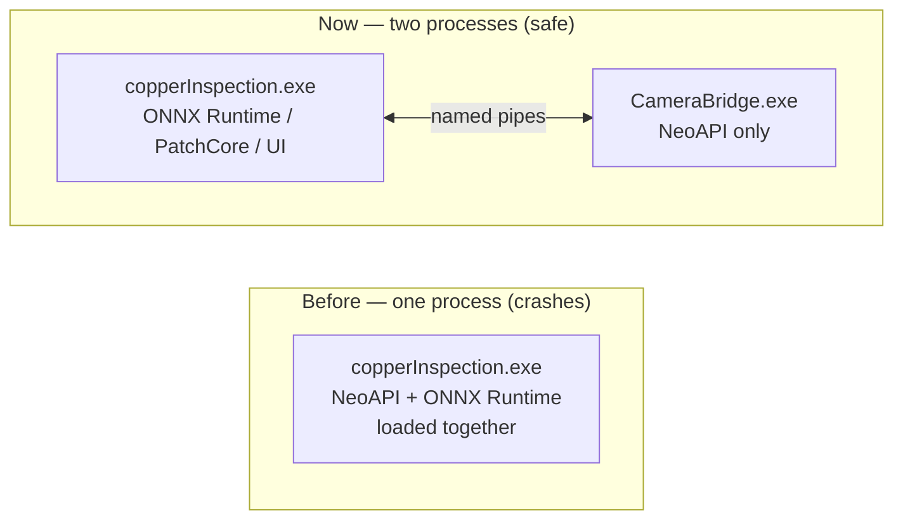

# Why the Camera Runs in Its Own Process

**For:** anyone (including future-you) wondering why there's a whole second
`.exe` (`CameraBridge.exe`) instead of the camera just being part of the main
app, like everything else.

## TL;DR

We tried putting the camera SDK straight into the main app. It crashed the
whole program instantly, every time, the moment the AI model tried to load —
even with no camera plugged in. So the camera now runs in its **own separate
program**, and the main app just talks to it over a private pipe. Two
programs can't corrupt each other's memory; one program's two toolkits can.

## The problem, in plain terms

This app relies on two separate third-party toolkits:

- **NeoAPI** — Baumer's SDK for talking to the physical camera.
- **ONNX Runtime** — Microsoft's engine that runs the PatchCore AI model.

Each of these brings its own pile of supporting files (`.dll` files) that get
loaded into memory when the toolkit is used. Individually, both work fine.
But when **both are loaded into the same running program**, something in how
they set up their supporting files clashes — and Windows kills the entire
program outright with an *access violation* (a hard, low-level crash — not a
friendly error message, the app just vanishes).

We confirmed this has nothing to do with an actual camera being plugged in.
We wrote a 20-line throwaway test program that did nothing but (1) ask NeoAPI
"any cameras around?" and (2) load the AI model — no camera attached, no UI,
none of this app's own code. It crashed identically. That told us it's a
fundamental incompatibility between these two toolkits sharing one program,
not a bug we could patch our way around.

## Why it happens (slightly more technical)

Think of loading a `.dll` like fetching a specific tool from a shared toolbox
in the room a program is running in. Most programs bring their own tools and
that's the end of it. But some SDKs, when they start up, also **rearrange
where the room looks for tools** — so they can find their own extra bits.

NeoAPI does something like this while it looks for cameras. That's normally
harmless — right up until something *else* in the same room goes looking for
a tool right afterward. That's exactly what happens here: NeoAPI runs its
camera search first, quietly changes where the program looks for supporting
files, and moments later ONNX Runtime goes looking for *its* files and picks
up something that isn't quite what it expected. The result is ONNX Runtime
reading garbage instead of real data, which is what an access violation
actually is under the hood.

(We didn't need to prove the *exact* mechanism to know the fix — see below.)

## The fix: two programs instead of one

- **`copperInspection.exe`** — the app you actually see. Runs PatchCore,
  Color Difference, the UI, MongoDB reports. It has **never** referenced
  NeoAPI directly and must not start now.
- **`CameraBridge.exe`** — a small, separate program whose only job is
  talking to the camera through NeoAPI. The main app launches it
  automatically in the background; you never open it yourself.

Because these are two different Windows processes, they each get their own
private slice of memory and their own independent "where do I look for
supporting files" setup. Nothing one of them loads can reach into the other's
memory or confuse the other's file lookups — not "unlikely to," but
*structurally cannot*, the same way one running program can't directly
scribble into a different program's memory. That's the actual fix: not a
smarter workaround, just making the collision impossible by construction.

## How the two programs talk to each other

They're connected by two **named pipes** — a private, local communication
channel between two programs on the same PC (nothing goes over the network):

- **Control pipe** — the main app sends short commands and waits for a
  reply: *"what cameras are there?"*, *"connect to this one"*, *"start/stop
  the live feed"*, *"grab me one frame right now."*
- **Preview pipe** — a one-way stream of compressed preview images, just
  for what you see on screen. It's deliberately lossy (compressed) to keep
  this cheap and fast.

Important detail: clicking **Capture** never reuses one of those compressed
preview images. It sends a fresh request over the control pipe and gets back
one uncompressed frame — so what actually feeds the AI model is always a
clean, full-quality image, never the same one being shown live on screen.

## The one rule that keeps this working

**Never add the `neoAPI` NuGet package to `copperInspection.csproj`** (the
main app's project file). It only belongs in `CameraBridge.csproj`. If it
ever ends up in both, the original crash comes right back — this has already
happened once by accident (adding it "to fix a build issue" that turned out
to be unrelated) and was reverted.

If this crash ever reappears, the first thing to check is exactly that:
open `copperInspection.csproj` and confirm `neoAPI` isn't listed there.

## Where the code actually lives

| File | What it does |
|---|---|
| `CameraBridge/Program.cs` | The separate camera process. Only file in the whole solution allowed to `using NeoAPI;`. |
| `Camera/CameraProtocol.cs` | The shared "language" both programs speak over the pipes — pipe names, message formats. Linked into both projects so there's one source of truth. |
| `Camera/BaumerCamera.cs` | The main app's side of the conversation — launches `CameraBridge.exe`, sends it commands, receives the live preview and captured frames. Contains **no** NeoAPI references. |
| `copperInspection.csproj` | Builds `CameraBridge.exe` as a separate step and copies it into its own `CameraBridge\` subfolder — deliberately never merged into the main app's own output folder. |

See `docs/WORK_LOG.md` (Aug 27, 2026 entries) for the full blow-by-blow of
how this was diagnosed, if you want the detailed evidence instead of the
summary above.
