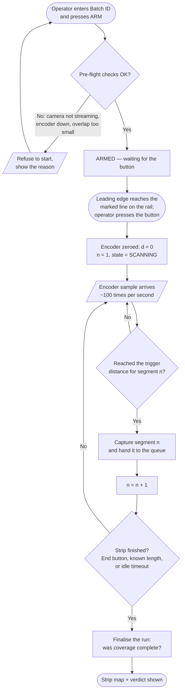
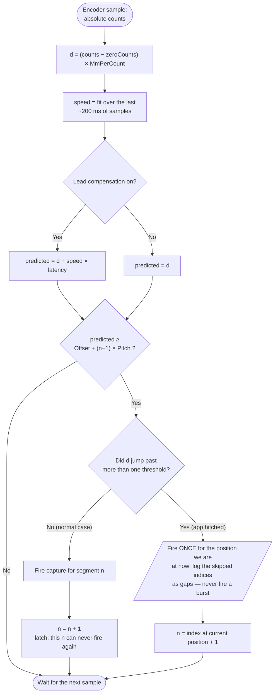
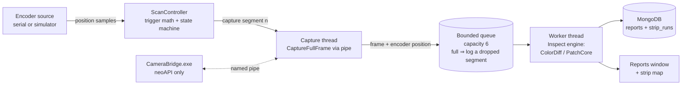

# Continuous Strip Scanning — Encoder-Triggered Capture

**The production setup:** camera fixed above the line, copper strip passes
underneath. An operator presses a button as the strip arrives; an encoder
reports travel distance and is zeroed by that press. Strip speed varies
between strips (max ~10 m/min). One camera frame covers ~1 m of strip along
the direction of travel.

**The question this answers:** after the first frame, how do we know when to
take the next one?

---

## The flow at a glance

### A. One strip, start to finish (what the operator sees)



The loop `F → G → H → I → F` is the whole answer to "how do I capture the next
part": keep watching the encoder, and fire again every `Pitch` millimetres.
**Nothing in that loop knows or cares how fast the strip is moving.**

### B. What happens on every encoder sample (the trigger decision)



The two guards on the right are the ones that are easy to leave out and
painful to debug later: the **latch** stops a jittering or reversing encoder
from re-firing a segment, and the **no-burst rule** stops the app from
capturing four frames back-to-back after a hitch and labelling them with
positions the strip has already passed.

### C. Where the work runs



The queue exists for one reason: **the capture path must never wait on
inspection.** If a PatchCore run takes 3 s, the capture thread has already
grabbed and enqueued the next segment and gone back to watching the encoder.
Without the queue, a slow inference silently eats a trigger and you lose a
metre of strip with nothing in the log to say so.

### D. What the frames actually cover

With `Fov` = 1000 mm and `Overlap` = 80 mm, the pitch is 920 mm:

```
                   0         1 m       2 m       3 m       4 m
                   ├─────────┼─────────┼─────────┼─────────┼──▶  strip position

frame 1    0–1000  ▓▓▓▓▓▓▓▓▓▓
frame 2  920–1920           ▓▓▓▓▓▓▓▓▓▓
frame 3 1840–2840                    ▓▓▓▓▓▓▓▓▓▓
frame 4 2760–3760                             ▓▓▓▓▓▓▓▓▓▓
                            ↑
                     80 mm overlap at every seam — so a defect on a
                     boundary is whole in one of the two frames, and
                     no timing error can open an un-imaged gap
```

Note that **frame 1 fires at d = 1000 mm, not at the button press** — at the
press the field of view is still empty conveyor. That off-by-one-FOV is the
single easiest thing to get wrong here; §2 works through why.

---

## 1. The core idea: trigger on distance, never on time

Speed varies, so a timer cannot work — at 10 m/min a 6-second timer covers
1 m, but at 4 m/min the same timer covers 400 mm and you re-image the same
material three times while the strip crawls; if the line surges you skip
material entirely and never know.

The encoder removes speed from the problem completely. **Every capture fires
at a fixed distance interval, not a fixed time interval.** The line can speed
up, slow down, or stop mid-strip; the frames still land on the same places on
the strip. Nothing in the trigger logic needs to know the speed at all.

That single sentence is the whole design. Everything below is detail.

---

## 2. The geometry — which frame images which metre

This is the part that is easy to get wrong by exactly one field of view, so
work it through explicitly.

```
                        camera (fixed in space)
                               │
                        ┌──────┴──────┐
       ─────────────────┤  FOV = 1 m  ├─────────────────
                        └─────────────┘
              entry edge ▲             ▲ exit edge

       strip travels ──────────────────────────▶
```

Let:

- `Fov` = field of view along travel (mm) — measured with the tape.
- `d` = encoder distance since the button press (mm), so `d = 0` at the press.
- `s` = position **along the strip**, measured from its leading edge.

The camera window is fixed; the strip slides through it. If the button is
pressed when the **leading edge reaches the entry edge**, then at distance `d`
the material sitting under the camera is:

    s ∈ [ d − Fov ,  d ]

| At `d` = | Material under the camera | Useful? |
|---|---|---|
| 0 mm | s ∈ [−1000, 0] | No — the FOV is still empty, only the leading edge has arrived |
| 500 mm | s ∈ [−500, 500] | Half strip, half empty conveyor |
| **1000 mm** | **s ∈ [0, 1000]** | **Yes — this is strip metre 0–1** |
| 2000 mm | s ∈ [1000, 2000] | strip metre 1–2 |
| 3000 mm | s ∈ [2000, 3000] | strip metre 2–3 |

**So the first frame is not taken at the button press — it is taken one full
FOV later.** Capture *n* fires at `d = n · Fov` and images strip region
`[(n−1)·Fov, n·Fov]`. "How do I capture the next part" has a one-line answer:
fire again every `Fov` millimetres of encoder travel, forever, until the strip
ends.

### 2.1 Which convention is your button press?

Your description — *"when strip enters that field of view then I will let them
press the button, it will serve as first part of strip like 0–1 meter, then a
frame is captured"* — mixes the two possible conventions: pressing at FOV
**entry** but capturing **immediately**. Those are inconsistent, and the
difference is exactly one metre of strip.

Make it an explicit setting rather than an assumption baked into the code:

| Press convention | `FirstTriggerOffsetMm` | Notes |
|---|---|---|
| Leading edge at FOV **entry** edge | `Fov` (1000) | Natural for an operator watching the strip approach |
| Leading edge at FOV **exit** edge (FOV full of strip) | `0` | Capture fires on the press itself |

**Recommendation:** during the FOV calibration in §7, put physical tape marks
on the guide rail at both FOV boundaries. Then "press when the leading edge
hits the line" is an unambiguous, repeatable instruction instead of a
judgement call, and the offset is whichever line you told them to use.

### 2.2 Overlap — do not use a pitch of exactly one FOV

If capture pitch equals `Fov` exactly, two things go wrong:

1. A defect straddling a boundary is sliced in half, and half a defect may
   fall under the minimum-area threshold in *both* frames — so it is missed
   twice.
2. Any error at all — button-press timing, encoder scale error, capture
   latency — produces a **gap**: strip that was never imaged. A gap is the
   dangerous failure mode, because the report claims coverage it does not
   have.

So overlap the frames:

    Pitch = Fov − Overlap
    trigger n fires at   d = FirstTriggerOffsetMm + (n − 1) · Pitch
    frame n covers strip [ (n−1)·Pitch , (n−1)·Pitch + Fov ]

Size `Overlap` as the **larger** of:

- 5–10 % of the FOV (50–100 mm for a 1 m FOV) — comfortable default; and
- `largest expected defect length + worst-case position error` (§4), so no
  defect can ever be cut by a boundary and no error can open a gap.

With `Fov` = 1000 and `Overlap` = 80, pitch is 920 mm: 11 frames per 10 m of
strip instead of 10. That is the entire cost of never having a gap.

> `Pitch` is **derived**, never stored in config — one source of truth. Store
> `Fov` and `Overlap`; compute pitch.

---

## 3. Motion blur — check this before writing any code

This is the constraint most likely to sink the project, and it is not
mentioned in the brief. The strip is moving while the shutter is open.

    blur_px = v (mm/s) × exposure (s) × px_per_mm

with

    px_per_mm = image_width_px / Fov_along_travel_mm

**Worked example** at 10 m/min (= 166.7 mm/s) with a 4096 px sensor across a
1 m FOV (4.1 px/mm):

| Exposure | Blur |
|---|---|
| 10 ms | 6.8 px — visibly smeared |
| 5 ms | 3.4 px |
| 2 ms | 1.4 px |
| **1 ms** | **0.7 px — acceptable** |

So exposure must be around **1–2 ms**, which means the lighting must be
strong enough to expose correctly at 1–2 ms. Plug your real sensor width and
real max speed into the formula before committing to a lens or a light.

Two related checks:

- **Global shutter required.** A rolling shutter scans the sensor row by row;
  with the subject moving, straight edges come out slanted and the geometry in
  §5 stops being valid. Confirm the Baumer model is global shutter.
- **Smallest detectable defect.** At 4.1 px/mm a 1 mm defect is ~4 px across.
  Decide the smallest defect that must be caught and confirm it survives both
  the pixel scale and the blur; this also feeds the overlap sizing in §2.2.

If blur turns out to be the binding constraint, the fixes in order of cost
are: brighter light → shorter exposure; a strobe fired by the trigger; or a
line-scan camera (which changes this design substantially — line-scan uses the
encoder to clock *every line*, not every frame).

---

## 4. Latency — the trigger fires late, and the strip does not wait

Between "encoder count crosses the threshold" and "shutter opens" there is:

1. the encoder sample interval (serial poll rate),
2. serial/USB transport,
3. the named-pipe round trip to `CameraBridge.exe` plus `CaptureFullFrame()`.

Item 3 is the unknown one and possibly the largest — it ships a full
uncompressed frame across a pipe ([Camera/BaumerCamera.cs:163](../Camera/BaumerCamera.cs#L163)).
At 166.7 mm/s:

| Total latency | Strip moved |
|---|---|
| 10 ms | 1.7 mm |
| 50 ms | 8.3 mm |
| 200 ms | 33 mm |

Every frame lands that far downstream of where it should. At constant speed
it is a constant offset, but speed varies strip to strip, so it is a real and
variable position error.

**Step one: measure it.** Log a monotonic timestamp
(`Stopwatch.GetTimestamp()`, never `DateTime.Now`) immediately before the
capture request and immediately after the frame arrives; average over a few
dozen captures. That number, `CaptureLatencyMs`, goes in config.

Then, in order of quality:

1. **Lead compensation (recommended default, pure software).** Fire the
   trigger early by the distance the strip will travel during the latency:

   ```csharp
   double predicted = position + speed * (CaptureLatencyMs / 1000.0);
   if (predicted >= nextThreshold) Fire();
   ```

   Speed is slow and near-constant within a strip, so this removes most of the
   error for the cost of three lines.

2. **Size the overlap to swallow the rest** (§2.2). Always do this as a
   backstop: `Overlap ≥ v_max × latency + margin`.

3. **Hardware trigger (upgrade path).** Wire the encoder controller's output
   to the camera's trigger input and configure neoAPI for hardware-triggered
   acquisition in `CameraBridge`. Latency drops to microseconds and the whole
   problem disappears. Worth doing if the measured software latency turns out
   to be >100 ms, or if line speed ever increases.

Whatever the scheme, **record the actual encoder position at the moment of
capture**, not the nominal threshold. The difference (`TriggerErrorMm`) is a
free quality signal: if it starts drifting, something is wrong with the
encoder, the line, or the latency estimate.

---

## 5. Mapping a defect back to a place on the strip

The operator's real question is not "was frame 7 bad" but "where on this strip
is the defect". Once frames are tied to encoder positions, that is arithmetic:

    strip_pos_mm  = SegmentStartMm + (pixel_along_travel / px_per_mm_along)
    cross_pos_mm  = pixel_across_travel / px_per_mm_across

Two configuration facts are needed because they depend on how the camera is
physically bolted on:

- `TravelAxis` — is travel along image X or image Y?
- `TravelReversed` — does increasing distance mean increasing or decreasing
  pixel coordinate?

Get these wrong and every defect is reported at a mirrored position, which is
worse than no position at all. Verify once with a deliberate mark on a test
strip.

**Overlap dedupe.** A defect in an overlap band appears in two consecutive
frames. Once boxes are in strip coordinates, merge any two boxes from adjacent
segments whose strip-coordinate rectangles overlap by more than ~50 %. Do this
at the strip-run level, not per frame — per frame there is no way to know.

---

## 6. Failure handling — the safety-critical part

A defect-inspection report is a claim about coverage. Every rule here exists so
the system never claims to have inspected strip it did not inspect.

| Situation | Required behaviour |
|---|---|
| Encoder disconnects mid-strip | **Abort the run**, alarm, mark coverage incomplete. **Never** fall back to a timer — a timer assumes constant speed, which is the exact assumption the encoder exists to remove. A silent time-based fallback would produce a clean-looking report for unverified strip. |
| Camera capture fails on one segment | Log the segment as failed, keep scanning, mark the run incomplete. One bad segment must not abort a 200 m strip, but it must not be silently forgotten either. |
| Processing queue full | Log a **dropped segment** loudly and mark coverage incomplete. Never silently drop. |
| Line stops mid-strip | Nothing happens. `d` stops advancing, no triggers fire. Correct by construction — no special case needed. |
| Line reverses / encoder jitters backwards | Latch on `_nextSegment`: only ever fire for a segment index not yet fired, and only on an upward crossing. Never re-fire. |
| `d` jumps past several thresholds in one sample | Fire **once** for the current position; log the skipped indices as gaps. Do **not** fire a burst — those thresholds are positions in *space*, and that material is already gone. A frame captured late for segment 5 while the strip is at segment 7 contains segment 7's material labelled as segment 5, which is worse than an honest logged gap. |
| Encoder counter overflow | Use `long` counts on the PC side; define the MCU's counter width and handle wrap explicitly (at 166 mm/s a 32-bit count at 0.05 mm/count lasts ~7 days of continuous running — unlikely but not never). |

### End-of-strip detection

Options, best first:

1. **"End Strip" button in the UI** — explicit, unambiguous, no extra hardware.
2. **Known strip length** in config or a per-run field → stop after
   `ceil(Length / Pitch)` segments.
3. **Trailing-edge photo-eye** → most automatic, needs hardware.
4. **Idle timeout** — no encoder movement for N seconds → auto-finalise.

Implement (1) and (2), with (4) always on as a safety net so a forgotten strip
never leaves a run open indefinitely.

---

## 7. Calibration procedure (do this before any code runs on the line)

**A. Encoder scale (`MmPerCount`)** — the single most important number.

1. Mark the strip at the FOV entry line.
2. Run a long measured distance — **5 m or more**, not 200 mm; error divides
   by the distance, so a long run gives a far better number.
3. Record counts travelled. `MmPerCount = measured_mm / counts`.
4. Repeat three times and check agreement within ~0.2 %.

The encoder wheel must not slip. Prefer a driven roller or a spring-loaded
measuring wheel. A 1 % scale error is 10 mm per segment — harmless for
coverage (the overlap absorbs it) but it accumulates in *reported position*:
by segment 50 a defect is mislocated by half a metre.

**B. Field of view (`FovAlongTravelMm`)** — lay a tape measure along the travel
direction in the camera's view, capture a frame, read off the span. Mark both
FOV boundaries on the guide rail with tape while you are there (§2.1).

**C. Pixel scale (`px_per_mm`)** — from the same frame:
`image_width_px / FovMm`. A tape gives ~1–2 % accuracy, fine for a defect map.
If you need better, or if lens distortion at the frame edges matters, use a
printed ruler or checkerboard target across the full width.

**D. Capture latency (`CaptureLatencyMs`)** — §4.

**E. Travel axis and direction** — §5, verified with a deliberate mark.

---

## 8. Configuration

Extend the existing hand-editable `config.json` pattern
([PipelineConfig.cs](../PipelineConfig.cs)) with a nested `Scan` object:

```json
"Scan": {
  "FovAlongTravelMm":      1000.0,
  "OverlapMm":               80.0,
  "FirstTriggerOffsetMm":  1000.0,

  "MmPerCount":               0.05,
  "TravelAxis":               "X",
  "TravelReversed":          false,
  "PxPerMmAlong":             4.1,
  "PxPerMmAcross":            4.1,

  "EncoderPort":            "COM3",
  "EncoderBaud":            115200,
  "EncoderSampleHz":           100,

  "CaptureLatencyMs":        120.0,
  "LeadCompensation":         true,
  "MaxLineSpeedMmPerSec":    170.0,

  "QueueCapacity":               6,
  "IdleTimeoutSec":           20.0,
  "StripLengthMm":               0,

  "SimulateEncoder":         false,
  "SimulatedSpeedMmPerSec":  166.7
}
```

**Validate at arm time, not at startup**, and refuse to start a run with a
clear message if:

- `Fov − Overlap <= 0`
- `Overlap < MaxLineSpeedMmPerSec × CaptureLatencyMs/1000` — the overlap
  cannot absorb the worst-case latency, so gaps are possible
- `MmPerCount <= 0`, encoder not connected, camera not streaming

Failing loudly at the button press is much better than producing a run whose
coverage is quietly untrustworthy.

---

## 9. Code structure

### 9.1 Encoder abstraction

```csharp
public readonly record struct EncoderSample(long Counts, double PositionMm, long TimestampTicks);

public interface IEncoderSource : IDisposable
{
    event Action<EncoderSample>? SampleReceived;
    event Action? ZeroSignalled;          // operator pressed the button
    event Action<string>? Faulted;        // disconnect, bad frame, timeout
    bool IsConnected { get; }
    void Start();
    void Stop();
}
```

Two implementations:

- **`SerialEncoderSource`** — reads ASCII lines from a COM port.
- **`SimulatedEncoderSource`** — a software ramp at `SimulatedSpeedMmPerSec`
  with a `SignalZero()` method wired to an on-screen button.

> The simulator is not a nice-to-have. It lets Phases 0–5 be built and tested
> at a desk with no encoder, no line, and no strip — which is most of the work.
> Build it first.

**Wire protocol** (MCU → PC, one line per sample at `EncoderSampleHz`):

```
P <seq> <absolute_counts> <button_state>\n     e.g.  P 4821 1043277 0
Z <seq> <absolute_counts>\n                    button pressed (edge)
```

Three deliberate choices:

- **Absolute counts since power-up, not a pre-zeroed distance.** The PC
  computes `d = (counts − counts_at_zero) × MmPerCount`. If a `Z` message is
  lost or the app reconnects mid-strip, absolute counts let it resync; if the
  MCU zeroed internally, that loss desynchronises silently and nothing
  downstream can tell.
- **Sequence number** so dropped samples are detectable rather than invisible.
- **Quadrature decoding stays on the MCU** (ESP32 PCNT, or a hardware
  interrupt on an Arduino), with the button debounced there too. Never attempt
  to count quadrature pulses in C# over a serial link.

If the encoder already arrives via a PLC, `SerialEncoderSource` becomes a PLC
client instead — the interface above does not change, which is the point of
having it.

### 9.2 Scan controller

```
        ┌──────┐  operator: Start Strip   ┌───────┐
        │ Idle ├─────────────────────────▶│ Armed │
        └──────┘                          └───┬───┘
           ▲                        Z received │ (d := 0)
           │                                   ▼
           │        ┌──────────────────────────────┐
           │        │          Scanning            │
           │        │  fire capture n at            │
           │        │  d = Offset + (n−1)·Pitch     │
           │        └───────────┬──────────────────┘
           │   End Strip / length reached /         │
           └───── idle timeout / fault ─────────────┘
```

`Scanning` is a pure function of encoder samples — unit-testable with no
hardware and no camera:

```csharp
// Returns the segment index to capture, or null.
int? OnSample(EncoderSample s)
{
    double d = (s.Counts - _zeroCounts) * _cfg.MmPerCount;
    double predicted = _cfg.LeadCompensation
        ? d + EstimateSpeedMmPerSec() * (_cfg.CaptureLatencyMs / 1000.0)
        : d;

    double threshold = _cfg.FirstTriggerOffsetMm + (_nextSegment - 1) * Pitch;
    if (predicted < threshold) return null;

    int n = _nextSegment;
    _nextSegment++;                       // latch: never re-fires for n
    return n;
}
```

Estimate speed from a short linear fit or EMA over the last ~200 ms of
samples. At 100 Hz and 0.05 mm/count, 200 ms at 166 mm/s is ~660 counts —
plenty of resolution.

### 9.3 Decoupling capture from processing

At 920 mm pitch and 10 m/min, a trigger arrives every ~5.5 s and PatchCore
inference takes 1–3 s, so there is headroom — but the capture path must never
be able to block on processing, or a slow inference silently eats a trigger.

```
 encoder samples ──▶ ScanController ──▶ capture thread ──▶ Channel<SegmentJob> ──▶ worker
                                        (CaptureFullFrame                          (inspect +
                                         + enqueue only)                            save report)
```

- Bounded `Channel<SegmentJob>` (capacity `QueueCapacity`, default 6).
- Capture thread does *only* `CaptureFullFrame()` and enqueue.
- One worker — the PatchCore detector is shared state; serialise access to it
  rather than assuming it is thread-safe.
- **Memory:** a 4096×3000 BGR frame is ~36 MB. A queue of 6 is ~220 MB of
  `Mat` buffers. Keep the bound small and dispose promptly.
- Queue full → drop, log loudly, mark run incomplete (§6).

### 9.4 Headless inspection engine

`RunDetectionPipelineAsync` ([MainWindow.xaml.cs:664](../MainWindow.xaml.cs#L664))
cannot be reused as-is: it reads radio buttons, writes `StatusLabel`, calls
`ClearResults()`, and paints the four image slots. The scan worker needs the
image processing without any of that.

Extract the body of its inner `Task.Run` into a UI-free static engine:

```csharp
public sealed record InspectionSettings(
    bool UseDiff, string? BgPath, SilhouetteParams Silhouette, DiffParams Diff,
    string DetectionMethod, double ColorThreshold, double ColorMinAreaPct,
    int ColorMorph, Scalar ReferenceBgr);

public sealed record InspectionResult(
    Mat Overlay, Mat Heatmap, string Verdict, double DefectPct,
    IReadOnlyList<Rect> Boxes, string? Note);

public static InspectionResult Inspect(Mat frame, InspectionSettings settings);
```

Then `RunDetectionPipelineAsync` becomes "snapshot settings from UI → call
`Inspect` → paint results", and the scan worker becomes "take job → call
`Inspect` → save report". One code path, so a manual Run Detection and a
scanned segment can never diverge in behaviour — which matters, because that
divergence is exactly the class of bug
[PATCHCORE_R50_FLOW_COMPARISON.md](PATCHCORE_R50_FLOW_COMPARISON.md) documents.

Keep the existing rule intact: the engine lives in the main process with ONNX
Runtime, the camera stays behind `CameraBridge.exe`, and neoAPI never enters
`copperInspection.csproj` ([CAMERA_ARCHITECTURE.md](CAMERA_ARCHITECTURE.md)).

### 9.5 Data model

Extend `DefectReport` ([ReportStore.cs](../ReportStore.cs)):

```csharp
[BsonElement("stripRunId")]      public ObjectId StripRunId { get; set; }
[BsonElement("segmentIndex")]    public int      SegmentIndex { get; set; }   // 1-based
[BsonElement("segmentStartMm")]  public double   SegmentStartMm { get; set; }
[BsonElement("segmentEndMm")]    public double   SegmentEndMm { get; set; }
[BsonElement("encoderMmAtCapture")] public double EncoderMmAtCapture { get; set; }
[BsonElement("triggerErrorMm")]  public double   TriggerErrorMm { get; set; }
[BsonElement("lineSpeedMmPerSec")] public double LineSpeedMmPerSec { get; set; }
[BsonElement("defectBoxes")]     public List<DefectBox> DefectBoxes { get; set; } = new();
```

And a new `strip_runs` collection, because "is this strip good, and where are
the defects" is a strip-level question that per-frame documents cannot answer:

```csharp
public sealed class StripRun
{
    public ObjectId Id { get; set; }
    public string   BatchId { get; set; } = "";      // operator-entered
    public DateTime StartedUtc { get; set; }
    public DateTime? EndedUtc { get; set; }
    public double   TotalLengthMm { get; set; }
    public int      SegmentCount { get; set; }
    public int      DefectSegmentCount { get; set; }
    public bool     CoverageComplete { get; set; }   // false if any drop/fail/gap
    public List<int> MissingSegments { get; set; } = new();
    public string   ConfigSnapshot { get; set; } = "";  // Scan config as JSON
}
```

`CoverageComplete` is the field the operator actually needs to trust. Snapshot
the config into the run so a report from six months ago can still be
interpreted after someone retunes the line.

Note that the reports window's live gallery now holds a fixed six frames and
trims the rest ([REPORTS_FIXED_SLOTS_PLAN.md](REPORTS_FIXED_SLOTS_PLAN.md)),
so a 200-segment strip will not grow the UI without bound — `AddLiveReport` is
already the right hook for scanned segments.

### 9.6 UI — a "Strip Scan" panel

- Encoder status: connected / port / live position mm / speed mm/s.
- Batch ID field, **Arm** and **End Strip** buttons.
- Live readout: `Segment 12 · next trigger at 11,200 mm · 8.4 m scanned`.
- **Strip map** — a horizontal bar, one tick per segment, green/red/grey
  (grey = dropped or failed). Click a tick to open that segment's image. This
  is the feature the operator will actually use; the map answers "where is the
  defect" at a glance in a way a list of 200 frames never will.
- Dropped/failed segments in an unmissable colour, plus a coverage-complete
  indicator for the run.

---

## 10. Suggested build order

Phases 0–5 need **no encoder and no line** — the simulator stands in — so most
of the work can be built and tested at a desk.

| Phase | Deliverable | Verifiable by |
|---|---|---|
| **0** | `Scan` config section, trigger math, validation rules | Unit tests on the pitch/threshold arithmetic |
| **1** | `IEncoderSource` + `SimulatedEncoderSource` | Position readout counts up on screen at the set speed |
| **2** | `ScanController` state machine + trigger latch | Unit tests: variable speed, stop, reverse, jump-past-threshold |
| **3** | Headless `Inspect` engine extracted from `MainWindow` | Manual Run Detection still produces identical results |
| **4** | Capture thread + bounded queue + worker + reports | Simulated run over a real camera pointed at a static target |
| **5** | Strip Scan UI + strip map + `StripRun` records | Full dry run end to end, simulator driving |
| **6** | `SerialEncoderSource` + MCU firmware; calibrate (§7) | First real strip |
| **7** | Optional: hardware trigger to camera; overlap dedupe | Measured trigger error stops varying with speed |

---

## 11. Things I need from you

These change the design materially, so they are worth settling before Phase 0:

1. **"10/min" — 10 metres per minute, or 10 strips per minute?** Every formula
   here is parametric in `v_max`, and the worked examples assume 10 m/min
   (166.7 mm/s). If it is 10 *strips* per minute, the real speed is
   `10 × strip_length / min`, which for a 20 m strip is 200 m/min — twenty
   times faster, and §3's blur maths then rules out this whole approach in
   favour of a line-scan camera. This one matters most.
2. **Button press convention** — leading edge at FOV entry, or FOV already
   full? (§2.1)
3. **Where does the encoder signal arrive?** PLC, MCU, or counter card — and
   over what (RS-232/485, Ethernet, raw pulses)?
4. **Camera model, resolution, global vs rolling shutter, hardware trigger
   input?** (§3, §4)
5. **Strip length** — known in advance, fixed, or variable? (§6)
6. **Does one frame cover the full strip width?** If not, this becomes a 2-D
   tiling problem and needs a second axis or a second camera.
7. **Is the strip laterally guided?** Side-to-side wander breaks pixel-exact
   reference diff; PatchCore tolerates it better.
8. **Smallest defect that must be caught** (mm) — drives pixel scale, blur
   budget, and overlap sizing.
