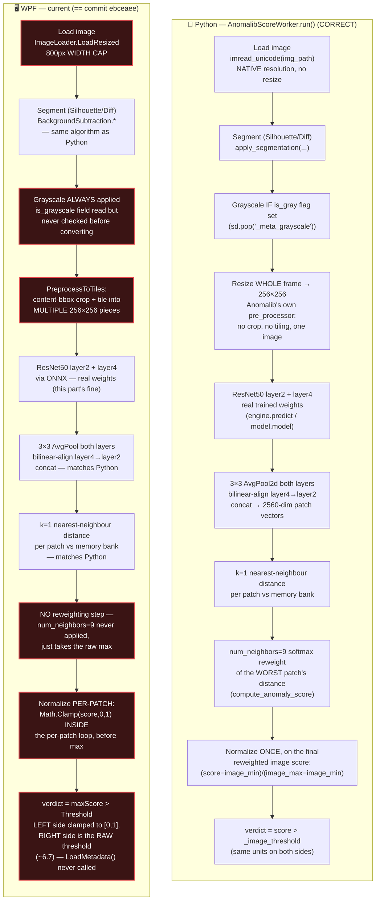

# PatchCore-ResNet50: Python Test Tab vs WPF — Flow Comparison & Fix

## TL;DR

**This is not a new bug.** `Detection/PatchCoreDetector.cs` and `MainWindow.xaml.cs`
are currently **identical to git commit `ebceaee`** (`git diff HEAD --
Detection/PatchCoreDetector.cs` is empty; `MainWindow.xaml.cs` differs by two
whitespace lines only) — an earlier, already-diagnosed-and-fixed version. All
of the PatchCore-R50 fixes built up over this project's debugging sessions
(metadata loading, unit-consistent thresholding, the real Anomalib
preprocessing pipeline, the `num_neighbors=9` reweighting) were **never
committed**, and the working tree has been reset back to `ebceaee` at some
point — discarding them. Nothing below required new investigation; it's a
diff against code that already existed and worked. §4 gives the exact edits
to restore it.

---

## 1. Two flows, side by side

The left column is `D:\copper_bgsubtraction\copper\Train\patchcore_gui_app.py`
→ `AnomalibScoreWorker.run()` (Test tab → Run Inspection) — confirmed correct,
gives sane GOOD/BAD verdicts. The right column is the **current** WPF code
path — `MainWindow.xaml.cs` → `PatchCoreDetector.Inspect()`. Red = diverges
from Python in a way that changes the verdict.



**Why C10 alone guarantees a wrong verdict:** every per-patch score gets
clamped to `[0, 1]` at C9, so `maxImageScore` is `1.0` for essentially any
real image (raw Euclidean distances in 2560-dim space are almost always
`> 1`). Then `isDefect = maxImageScore > Threshold` compares `1.0` against
the *raw* threshold (`~6.7`, straight from `meta.json`, never normalized).
`1.0 > 6.7` is **never true** — every image reads GOOD, defective or not,
regardless of what C1–C8 do. That's the "GOOD on defective parts" you're
seeing. C1, C3, C4, and C8 are real, separate accuracy problems on top of
that, but C9+C10 alone would sink the verdict even if everything else were
perfect.

---

## 2. Divergence table (file / line level)

| # | Step | Python (correct) | WPF (current = `ebceaee`) | Consequence |
|---|---|---|---|---|
| C1 | Image resolution | Native (`imread_unicode`, no resize) | `ImageLoader.LoadResized` caps width at 800px | Fixed-size (5×5) morphology kernels in `BackgroundSubtraction` erode/smooth proportionally more at 800px than at native res → different segmented mask → different score. Confirmed empirically: same image+settings scored GOOD at native res, BAD at 800px. |
| C3 | Grayscale | Conditional on the checkpoint's `_meta_grayscale` flag | `ExtractFeaturesBatch` always grayscales (`float gray = 0.299R+0.587G+0.114B`), no `if` at all | If a checkpoint was trained in colour (current `Assets/patchcore_resnet50_meta.json` says `"is_grayscale": false`), WPF still force-grayscales every input — feeding the network different pixel data than training used. |
| C4 | Preprocessing method | One `Resize((256,256))` on the whole frame — `Patchcore.configure_pre_processor` in Anomalib's `lightning_model.py`. No crop, no tiling. | `PreprocessToTiles`: crops to the non-black content bbox, then **tiles** it into possibly several 256×256 pieces (the ResNet18/`sample_patchcore.py` recipe) | Completely different input(s) reach the network — different number of forward passes, different crops, aspect ratio not squashed the way training saw it. This recipe is correct for ResNet18 (trained by `sample_patchcore.py`, which really does crop+tile) but wrong for this Anomalib-trained ResNet50. |
| C8 | Image-level scoring | `PatchcoreModel.compute_anomaly_score` (`torch_model.py`): with `num_neighbors=9` (this model's training config, `Train/trainer.py`), re-weights the worst patch's distance by a softmax factor from the local neighbourhood of its best memory-bank match | Just takes `max` of all per-patch scores, no reweighting | Systematically different (usually larger) score than Python for the same features. |
| C9 | Where normalization happens | Once, on the **final** (reweighted) image-level score | **Per patch**, inside the search loop, before the max is taken | Clamping every patch to `[0,1]` before taking the max destroys the actual scale of the worst patch — `maxImageScore` collapses to `1.0` for almost anything. |
| C10 | Threshold comparison | Both sides in the same units (raw-to-raw, or normalized-to-normalized — Python is internally consistent) | Left side normalized-and-clamped (`≤1.0`), right side raw (`~6.7`) — units mismatch | `1.0 > 6.7` is always false → **always GOOD**, independent of image content. |
| — | Metadata loading | N/A (Python reads the checkpoint directly) | `PatchCoreDetector.LoadMetadata(string jsonPath)` exists as a public method but **is never called from the constructor or from `GetOrLoadDetector`** (`MainWindow.xaml.cs:299`: `new PatchCoreDetector(onnxPath, binPath, threshold)` — only a bare `float`) | `_imageMin`/`_imageMax` stay at their hardcoded defaults (`0`/`1`) forever — this is *why* C9's clamp is a no-op-looking `[0,1]` clamp instead of the intended `[image_min, image_max]` range. |

---

## 3. What's *not* broken

Worth naming so the fix stays scoped: C2 (segmentation algorithm itself),
C5 (ONNX weights — the earlier "random untrained weights" bug is fixed and
stays fixed, it's a Python-side export script issue, untouched by this
regression), C6 (3×3 pooling + bilinear alignment), and C7 (the k=1 nearest-
neighbour search) all already match Python. Don't touch those.

---

## 4. Suggested edits (not applied — apply these to the two files)

### 4.1 `Detection/PatchCoreDetector.cs`

**Constructor + metadata** — replace the bare-`float` constructor and the
orphaned public `LoadMetadata` with metadata loaded once, in the
constructor, from a `metaPath`:

```csharp
private float _imageMin, _imageMax;
private bool _hasMinMax;
private bool _isGrayscale;
private bool _useAnomalibPipeline;   // true when meta.json has image_min/image_max
private float _normalizedThreshold;
public float Threshold { get; private set; }

public PatchCoreDetector(string onnxPath, string bankBinPath, string metaPath)
{
    LoadMetadata(metaPath);
    var options = new SessionOptions { ExecutionMode = ExecutionMode.ORT_SEQUENTIAL,
                                        GraphOptimizationLevel = GraphOptimizationLevel.ORT_ENABLE_ALL };
    _session = new InferenceSession(onnxPath, options);
    LoadMemoryBank(bankBinPath);
}

private void LoadMetadata(string jsonPath)
{
    var root = System.Text.Json.JsonDocument.Parse(File.ReadAllText(jsonPath)).RootElement;
    Threshold = root.TryGetProperty("threshold", out var t) ? t.GetSingle() : 0.5f;

    bool hasMin = root.TryGetProperty("image_min", out var minElem);
    bool hasMax = root.TryGetProperty("image_max", out var maxElem);
    _hasMinMax = hasMin && hasMax;
    _useAnomalibPipeline = _hasMinMax;

    if (_hasMinMax)
    {
        _imageMin = minElem.GetSingle();
        _imageMax = maxElem.GetSingle();
        float range = (_imageMax - _imageMin) + 1e-6f;
        _normalizedThreshold = Math.Clamp((Threshold - _imageMin) / range, 0f, 1f);
    }
    else
    {
        _normalizedThreshold = Threshold;  // ResNet18: no calibration range, compare raw-to-raw
    }

    _isGrayscale = root.TryGetProperty("is_grayscale", out var g) && g.GetBoolean();
}
```

**Grayscale conditional** — in `ExtractFeaturesBatch`, gate the grayscale
conversion on `_isGrayscale`; use the plain RGB branch otherwise (already
present as dead code in earlier versions — just needs the `if`).

**Preprocessing** — add a `PreprocessSingleResize` (one
`Cv2.Resize(bgr, resized, new Size(256,256))`, no crop, no tiling) used when
`_useAnomalibPipeline` is true; keep `PreprocessToTiles` only for the
`false` (ResNet18) case.

**Reweighting** — add a `ReweightScore(worstPatchFeatures, nnIndex, rawScore)`
that, for `_useAnomalibPipeline` only: finds `nnIndex`'s own `k=9` nearest
neighbours *within the memory bank*, computes the worst patch's distance to
each of those 9, and returns `(1 - softmax(those 9 distances)[0]) * rawScore`
— porting `PatchcoreModel.compute_anomaly_score`'s `num_neighbors>1` branch
exactly.

**Score + verdict** — compute `rawMaxScore` as today (max raw distance, no
per-patch clamping), apply `ReweightScore` when `_useAnomalibPipeline`,
*then* normalize the single resulting scalar:

```csharp
float finalRawScore = _useAnomalibPipeline
    ? ReweightScore(worstPatchFeatures, bestNnIndex, rawMaxScore)
    : rawMaxScore;

float displayScore = _hasMinMax
    ? Math.Clamp((finalRawScore - _imageMin) / ((_imageMax - _imageMin) + 1e-6f), 0f, 1f)
    : finalRawScore;

bool isDefect = displayScore > _normalizedThreshold;
```

### 4.2 `MainWindow.xaml.cs`

**`GetOrLoadDetector`** — stop hand-parsing `threshold` out of the JSON;
pass the metadata path straight through:

```csharp
if (!File.Exists(onnxPath) || !File.Exists(binPath) || !File.Exists(metaPath))
    throw new FileNotFoundException($"PatchCore asset files missing for {backboneName}.");

_detector = new PatchCoreDetector(onnxPath, binPath, metaPath);   // was: (onnxPath, binPath, threshold)
```

**Image loading for PatchCore** — load at native resolution for PatchCore,
keep the 800px path for Color Difference and the on-screen preview:

```csharp
bool isPatchCore = detectionMethod.StartsWith("PatchCore");
Mat target = isPatchCore ? ImageLoader.LoadFull(targetPath) : ImageLoader.LoadResized(targetPath);
...
using Mat bg = isPatchCore ? ImageLoader.LoadFull(bgPath!) : ImageLoader.LoadResized(bgPath!);
```

(`ImageLoader.LoadFull` — a plain `Cv2.ImRead` with no resize — needs adding
to `DefectDetector.cs` if it isn't there; it's a two-line addition.)

### 4.3 Also worth checking, not a code change

`Assets/patchcore_resnet50_meta.json` currently has `"is_grayscale": false`.
Confirm this actually matches how the current checkpoint (`Train/patchcore_model.pt`)
was trained (`_meta_grayscale` key in its state_dict) — if training used
grayscale, this field is wrong and needs re-exporting, not a C# fix.

---

## 5. After applying §4, commit it

Nothing in this fix history ever reached git — that's how it got lost once
already. Once §4 is applied and verified, `git add` + commit
`Detection/PatchCoreDetector.cs`, `MainWindow.xaml.cs`, and `DefectDetector.cs`
so a future `git checkout`/`reset` can't silently discard it again.
