# Work Log — Copper Strip Inspection App

> Chronological record of what's been built and why, plus a step-by-step trace
> of the PatchCore-ResNet18 run path. Read this alongside
> [PROJECT_CONTEXT.md](PROJECT_CONTEXT.md) (architecture snapshot for handing
> off to a new Claude chat) — this file is the "how we got here" companion to
> that "here's where things stand" one.

---

## 1. Timeline

### Commit `a8dc742` — "added bg subtraction and color ref subtraction" (Aug 22, 2026)

This was a **full pipeline rewrite**, not an addition. It replaced the earlier
manual-ROI-cropper approach (drag a box on a reference image and a target
image, compare colors inside those two boxes — see the now-superseded
`WPF_Conversion_Guide.md`/`detect_defects_color_roi_explained.md` docs) with a
**background-subtraction + whole-strip color-difference** pipeline, porting
two Python prototypes:

- `bg_subtraction_app.py` → [BackgroundSubtraction.cs](../BackgroundSubtraction.cs)
- `color_diff_inspector.py` → [Detection/ColorDiffDetector.cs](../Detection/ColorDiffDetector.cs)

Why the switch: instead of a person dragging ROI boxes on every image, the app
now isolates the component from its background automatically (it's photographed
backlit, so it's dark/silhouetted against a bright field), then compares every
kept pixel against **one saved reference color** loaded from a JSON file —
closer to a real "operator presses one button" inspection flow.

Also introduced in this commit:
- [PipelineConfig.cs](../PipelineConfig.cs) — a hand-editable `config.json`
  next to the `.exe` (not `%AppData%`) so an operator can retune thresholds
  without a rebuild.
- The old `Settings.cs`/`%AppData%` JSON settings, `RoiCropper`,
  `RedRoiExtractor`, and the old `DefectDetector.Detect()` (Euclidean /
  Z-score / legacy methods) were all **removed** — none of those files exist
  in the repo anymore.
- `ReportStore.cs`, `ReportsWindow.xaml(.cs)`, `BytesToImageConverter.cs`
  carried over unchanged from the prior version (MongoDB report gallery still
  works the same way).

### Commit `2822c71` — "Feat: added patchcore(Res18) model detection via radio bubble select" (Aug 25, 2026 — today)

Added a **third detection method** alongside Color Difference:
[Detection/PatchCoreDetector.cs](../Detection/PatchCoreDetector.cs) — an
ONNX-Runtime-based port of the PatchCore anomaly-detection model (see
`Assets/PATCHCORE_CODE_EXPLAINED.md` for the Python-side background). Changes:

- New radio bubbles in the Detection Method group:
  **Color Difference** (default) / **PatchCore — ResNet50** (UI wired, no
  ResNet50 model files shipped yet) / **PatchCore — ResNet18** (fully working
  — this is what §2 traces).
- `MainWindow.xaml.cs`: `GetOrLoadDetector()` lazily loads and caches a
  `PatchCoreDetector` per backbone name; `RunBtn_Click` branches to
  `detector.Inspect(...)` when the selected method starts with `"PatchCore"`.
- `Microsoft.ML.OnnxRuntime` 1.29.0 added to the `.csproj`.
- `Assets/patchcore_resnet18_meta.json` (threshold + memory-bank dimensions)
  and `Assets/reference_color1.json` added.

**Model artifacts are intentionally not in git** — `.gitignore` excludes
`*.onnx`, `*.onnx.data`, and `Assets/*.bin` (the memory bank alone is
~150 MB; GitHub hard-rejects anything over 100 MB). On disk right now,
`Assets/` holds `patchcore_resnet18.onnx` (62 KB — just the graph),
`patchcore_resnet18.onnx.data` (11 MB — external weights), and
`patchcore_resnet18_bank.bin` (157 MB — the memory bank), but **these three
files must be present locally / copied from shared storage** on any machine
that runs PatchCore-R18 — a fresh `git clone` will not have them.

### Fix — "PatchCore-R18 always says BAD, even on training images" (Aug 25, 2026 — today)

Reported symptom: every image scored BAD in PatchCore-R18 mode — including
images that were literally in the memory bank's own training set — while the
Python app (`sample_patchcore.py`) gave the correct GOOD verdict on the same
files. That ruled out the image content, the background-subtraction settings,
and the calibrated threshold as causes; it had to be a difference in how the
two apps turn an image into the feature vectors that get compared against the
memory bank.

**Why this happened:** `PatchCoreDetector.cs` was written against a *bare*
ONNX export. `D:\copper_bgsubtraction\copper\export_patchcore_to_onnx.py`
(which writes directly into this repo's `Assets/`) only traces
`conv1→…→layer2→layer3` — it exports the raw ResNet18 feature maps and
nothing else. Every PatchCore-specific step downstream of that — cropping to
the actual component, tiling, smoothing, and aligning the two feature layers
— happens in Python code that never got ported, so the memory bank (built by
`D:\copper_bgsubtraction\copper\sample_patchcore.py`, `PatchCoreEngine`) and
the C# scoring path were computing feature vectors by two different recipes.
Comparing them against each other was comparing apples to oranges regardless
of what image was tested. Four concrete gaps, diffed directly against
`PatchCoreEngine.preprocess` / `extract_patch_features`
(`sample_patchcore.py` lines 56-192):

1. **No crop-to-content before scaling.** Python crops tightly to the
   bounding box of non-black pixels *first*, then scales that crop so its
   short side is 256px. The old C# `Extract256Patches` scaled the **whole**
   background-subtracted frame (strip + all the black margin from
   `BackgroundSubtraction`) instead — the component ended up far smaller
   inside each tile than the memory bank was trained on.
2. **No near-empty-tile filter.** Python discards any 256×256 tile that's
   less than 10% non-black (`MIN_FILL = 0.10`) — the model never trained on
   tiles that are mostly background. The old C# code scored *every* tile,
   including ones that were mostly/entirely black, which the memory bank has
   no "normal" example of and which score as wildly anomalous.
3. **Missing 3×3 neighbourhood smoothing.** Python averages every `layer2`/
   `layer3` feature with its 3×3 neighbours (`nn.Unfold(kernel=3, padding=1,
   stride=1).mean(...)`) before anything else. The old C# code used the raw,
   unsmoothed features.
4. **Wrong layer3→layer2 alignment.** Python bilinear-interpolates layer3
   onto layer2's grid (`F.interpolate(..., mode="bilinear")`) so patch *i*
   means the same physical location in both layers. The old C# code used a
   cruder nearest-index lookup instead.

Items 1–2 dominate: most of a typical background-subtracted frame here is
black, so nearly every tile the old code fed the model looked like nothing
in the memory bank — driving the max anomaly score over threshold on
essentially any input.

**The fix**, in [Detection/PatchCoreDetector.cs](../Detection/PatchCoreDetector.cs):
`Extract256Patches` was replaced with `PreprocessToTiles` (content-bbox crop
via `TryContentBoundingBox`, then letterbox-onto-one-tile-or-slide-tiles via
`Starts`, with the `MinFill` check), and `SplitBatchAndAlign` now runs
`Smooth3x3` (zero-padded 3×3 average, matching `count_include_pad=True`) on
both layers before `BilinearResize` (a hand-written half-pixel bilinear
resize matching PyTorch's `align_corners=False` convention) aligns layer3
onto layer2's grid. `ExtractFeaturesBatch`, `ComputeAnomalyScores` (the k=1
nearest-neighbour search — that part already matched Python) and the overall
`Inspect()` control flow were unchanged. Building the real per-tile heatmap
(§4 below) was deliberately left out of this fix to keep it scoped to the
verdict-correctness bug.

### Perf fix — nested-parallelism bug + real heatmap in slot 4 (Aug 25, 2026 — today)

Reported symptom: PatchCore-R18 inference takes 30–31 seconds per image.
(Some of that is an expected side-effect of the correctness fix above — the
old buggy tiling often produced only one, wrongly-framed tile; the fixed
content-crop tiling now correctly scores multiple real tiles down a strip's
long axis, i.e. genuinely more — correct — work than before.)

**Diagnosis:** the dominant cost is `ComputeAnomalyScores`'s brute-force k=1
nearest-neighbour search — for a 256×256 tile, ResNet18's layer2 grid is
32×32 = 1,024 spatial patches, each compared against all 102,400 memory-bank
vectors (384-dim) = ~105 million distance computations per tile. `Inspect()`
made this worse than it needed to be: it parallelized across tiles
(`Parallel.For` over `patches.Count`) and, *inside that*, `ComputeAnomalyScores`
*also* parallelized across the ~1,024 spatial points — nested `Parallel.For`s
oversubscribing the thread pool with far more concurrent work than there are
cores, fighting itself instead of helping.

**Fix (exact — no accuracy change):** the outer per-tile loop in `Inspect()`
is now a plain sequential `for`, not a `Parallel.For`. Each tile's own
`Parallel.For` over its ~1,000 spatial points already saturates available
cores on its own, so only one level of parallelism is ever active now. This
was intentionally kept to a scheduling-only fix — no approximation, no
reduced search — to keep results identical.

Two accuracy-preserving options that would speed this up further were
discussed and **not** applied per your call — coreset-shrinking the memory
bank (`sample_patchcore.py`'s `coreset_ratio`, e.g. 0.15–0.25) was flagged as
the biggest remaining lever, but rejected: you didn't want the accuracy
trade-off. An approximate-NN index (e.g. HNSW) was noted as a larger-effort
option to revisit later if the scheduling fix alone isn't enough.

**Real heatmap, in [Detection/PatchCoreDetector.cs](../Detection/PatchCoreDetector.cs):**
`PreprocessToTiles` now returns a `TileLayout` (each tile's `(tx, ty)` offset,
the scaled-crop size, and the content bounding box — the geometry dropped in
the correctness fix above to keep that change small) instead of a bare tile
list. `Inspect()` keeps each tile's anomaly-score grid instead of collapsing
it to one number, and a new `StitchHeatmap` places them back where they came
from — upsample each tile's grid to 256×256 (cubic), paste at its tracked
offset (max where tiles overlap), resize down to the content crop's pixel
size, paste into a black canvas the size of the full frame — mirroring
`PatchCoreEngine.score_image`'s placement exactly. `ColorizeHeat` normalizes
and applies the INFERNO colormap (matching Python's `heatmap_overlay`).
`Inspect()`'s signature is now
`(bool IsDefect, float Score, Mat HeatmapRaw, Mat HeatmapOnOriginal)` and
takes an optional `overlayBase` parameter — `MainWindow.xaml.cs` passes the
raw (pre-background-subtraction) photo for that, so:
- **Slot 3** ("Distance from Reference", `Cam2TargetImage`) = `HeatmapRaw` — the
  colourized anomaly map on its own.
- **Slot 4** ("Defect Mask", `Cam2ResultImage`) = `HeatmapOnOriginal` — the
  heatmap blended onto the **original** photo (not the background-subtracted
  view), matching what you asked for and matching Python's own
  `heatmap_overlay(rgb_image, heat)`.

### Root cause found — the memory bank was trained on one photo, not ten (Aug 25, 2026 — today)

After the correctness fix above, you confirmed good parts were **still** coming
back BAD. That ruled out the C# porting bugs as the (whole) explanation and
pointed at the training data itself.

**Investigation:** `sample_patchcore.py`'s trainer saves the exact source
folder path into the `.pt` checkpoint's own metadata
(`_bank_meta["source_folder"]`). Loading `results/patchcore_model_18.pt`
(via the `dl` conda env, since `torch` isn't in the base Python) and reading
that metadata directly — rather than guessing from folder names — gave:

```
threshold        -> 0.004296875
coreset_ratio     -> 1.0
source_folder     -> D:/Copper_Strip_Inspection/Archive/Image_dataset/images/img
images_used       -> 10
images_skipped    -> 0
calibration_images -> 2
```

That folder has 12 files (`good_reference1_fg.png`,
`good_reference1_fg - Copy.png`, `good_reference1_fg - Copy (2).png`, etc. —
the `- Copy`/`- Copy (2)` suffixes are Windows Explorer's automatic
duplicate-paste naming). **MD5-checksumming all 12 confirmed every single one
is byte-for-byte identical** — one real photo, copy-pasted 12 times. The
10-images-used-2-held-out-for-calibration bookkeeping in the checkpoint is
real, but all 10 "training" images and both "calibration" images are the same
underlying photo.

**What this means:** the memory bank never learned any real-world variation —
different lighting, slightly different framing, ordinary day-to-day
differences between photos of genuinely good parts. It memorized exactly one
snapshot. Any other photo, however good the part in it actually is, differs
from that one snapshot in harmless ways the model has no way to recognize as
normal, so it scores as anomalous. This is a **training-data problem, not a
code problem** — the C# porting fixes earlier in this log were still correct
and necessary (a faithful port can't be more accurate than what it was asked
to reproduce, but an unfaithful one guarantees extra error on top), but no
amount of further code fixing resolves this. It needs a retrain on a real,
diverse set of distinct good-part photos before PatchCore-R18's accuracy can
actually be evaluated fairly.

### PatchCore-ResNet50 calibration saga (Aug 26, 2026 — today)

A second backbone, PatchCore-ResNet50, was added (new radio bubble already
existed in the UI, previously unusable — see §4). Getting it to produce
correct verdicts took three rounds, each uncovering a different bug. Noting
all three here since they weren't logged in real time.

**Round 1 — units mismatch (`Threshold` never actually used correctly).**
Symptom: every sample, including defective ones, read GOOD. Cause:
`MainWindow.xaml.cs` constructed `PatchCoreDetector` with a bare `threshold`
float; a `LoadMetadata()` method existed to read `image_min`/`image_max` from
the meta.json but **nothing ever called it**, so those fields stayed at their
hardcoded defaults (`0`/`1`) forever. Combined with comparing a
normalized-to-`[0,1]` score against the raw (un-normalized) `Threshold`
(`6.8066`), every real ResNet50 distance (~15–45) clamped to `1.0`, and
`1.0 > 6.8066` is never true. Fix: consolidated all metadata loading into the
constructor (now takes `metaPath`, not a bare float), and made the threshold
go through the *same* transform as the score before comparing — mathematically
equivalent to comparing the two raw values directly, so it's correct
regardless of a backbone's raw-distance scale.

**Round 2 — wrong key read for the threshold, in the Python export script
itself.** After round 1's fix, verdicts were still off. Traced into
`D:\copper_bgsubtraction\copper\Train\export_patchcore_to_onnx.py`: the real
Anomalib checkpoint stores the calibrated decision threshold under
`post_processor._image_threshold` (`6.9896`), a **different** value from
`post_processor.image_min` (`6.8066`) — but the export script read
`image_min` and assigned it directly to `threshold`, so the JSON's threshold
was never the real one. This made the normalized threshold always compute to
exactly `0`. Fixed the export script to read the correct key (falling back to
`image_min` only if a checkpoint variant lacks it), and regenerated just
`patchcore_resnet50_meta.json` (no need to re-export the 90MB ONNX
graph/bank — those were already correct).

**Round 3 — the actual dominant bug: wrong preprocessing pipeline entirely.**
Even with a correct threshold, real raw distances (~50–55) were still
~4× the calibration range (6.8–13.6). The proposed fix at this point was to
divide the raw distance by a hand-fitted constant (`sqrt(dim/50)`, or
literally `/7.50f`, reverse-engineered from one sample's numbers) — rejected,
because a curve-fit constant doesn't generalize and doesn't explain *why*
the mismatch exists. Instead, traced into the installed `anomalib` package
directly (`site-packages/anomalib/models/image/patchcore/`) and found the
real cause: `PatchCoreDetector.cs` was preprocessing every image with
ResNet18's recipe (`sample_patchcore.py`'s content-crop + letterbox/tile) —
but this ResNet50 model was trained by **real Anomalib**
(`Train/trainer.py` → `anomalib.models.Patchcore`), whose actual
pre-processor (`Patchcore.configure_pre_processor` in
`lightning_model.py`) is a single `torchvision Resize((256,256))` applied to
the **whole frame** — no content-crop, no tiling, aspect ratio squashed if
needed. Feeding the model multiple oddly-cropped tiles instead of one
whole-frame-squashed image produces embeddings that look "foreign" to the
memory bank regardless of the actual image content — that's what was
inflating every raw distance. A second, smaller effect was also missing:
Anomalib's real `PatchcoreModel.compute_anomaly_score`
(`torch_model.py`) doesn't just take the worst patch's raw distance when
`num_neighbors > 1` — it re-weights that distance by a softmax factor
computed from the local neighbourhood of the best-matching memory-bank patch,
and `Train/trainer.py` trains this model with `num_neighbors=9`.

**The fix**, in [Detection/PatchCoreDetector.cs](../Detection/PatchCoreDetector.cs):
the detector now runs one of two genuinely different pipelines, selected
automatically by whether a backbone's meta.json carries `image_min`/
`image_max` (`_useAnomalibPipeline`):
- **ResNet18** (no `image_min`/`image_max`): unchanged — `PreprocessToTiles`
  (content-crop + letterbox/tile) and a plain worst-patch-across-all-tiles
  score, matching `sample_patchcore.py` exactly (as established in the
  earlier correctness fix above).
- **ResNet50** (has `image_min`/`image_max`): new `PreprocessSingleResize`
  (one whole-frame resize to 256×256, no crop, no tiling) plus a new
  `ReweightScore` that ports Anomalib's `num_neighbors=9` softmax
  reweighting exactly. Normalization now happens **once**, on the final
  (reweighted) image-level score — not per-patch as the two earlier rounds
  had it — matching where Anomalib's own min-max normalizer actually sits.

Both pipelines share the same ONNX inference, 3×3 smoothing, and bilinear
layer-alignment code (`ExtractFeaturesBatch`/`SplitBatchAndAlign`/
`Smooth3x3`/`BilinearResize`) — those were already correct for both
backbones and untouched by this fix.

**Round 4 — the ONNX export never loaded the real trained weights.** Even
with round 3's fix, raw scores (~2900) were still ~100× outside the
calibrated range. The proposed next step was another hand-fitted scaling
constant (`Math.Sqrt`, `/√2560`) — rejected for the same reason as round 3's
rejected fix: the arithmetic didn't even reach the claimed target, and a
curve-fit constant explains nothing. Instead, compared the ONNX file's actual
`conv1.weight` values against the checkpoint's real trained weights and found
`export_patchcore_to_onnx.py` builds the graph from `resnet50(weights=None)`
— **randomly initialized** — and never calls `load_state_dict` to load the
real trained backbone before `torch.onnx.export`. The exported model had been
running a completely different, untrained network the entire time; no amount
of algorithm fixing in C# could ever close that gap. Fixed by adding
`load_backbone_weights()` to the export script (maps
`model.feature_extractor.feature_extractor.*` checkpoint keys onto the export
model) and verified numerically — not just by re-reading code — by running
identical random input through both the corrected PyTorch model and the new
ONNX file: outputs matched to ~1e-5 (float noise).

**Round 5 — not a bug: a segmentation-threshold / training-mismatch, and a
moving-target checkpoint that briefly confused the investigation.** After
round 4's fix, a further "WPF says BAD, Python says GOOD" report surfaced.
Two false leads first: (a) the checkpoint had genuinely been retrained
mid-investigation (`Train/patchcore_model.pt`'s mtime moved from the file the
round-4 export had used), so for one round the two sides really were
comparing different model versions — resolved by exporting from the actual
current checkpoint; (b) the two comparison points turned out to use different
segmentation settings (Python's GUI defaults to auto-threshold/Otsu + keep=2,
independently of whatever the WPF app's `config.json` has saved), which
alone produces different scores from a correctly-behaving system on either
side — not a code discrepancy. Once both were confirmed matched (same
checkpoint, same `SilhouetteThreshold=100` manual setting, Auto Threshold
unchecked in the WPF UI), the two **agreed**: a direct Python replication
scored **every image in the test folder as BAD at threshold=100, including
`good_reference.jpeg`** (the named golden reference). Conclusion: this
particular trained model was calibrated on auto-threshold-segmented images,
and its normal-score band (6.19–12.39, a memory bank built from
auto-threshold training data) is narrow enough that a materially different
fixed threshold (100 vs Otsu's ~92 for this rig) shifts every raw score well
outside it, regardless of the actual part's condition. **Fix: none needed in
code** — switch the WPF app's Background Subtraction to Auto Threshold
(Otsu) so inference segmentation matches how this model was actually trained
and calibrated. Whatever segmentation setting is used at inference must match
training, or the model has no basis for recognizing a differently-segmented
good part as normal — the same underlying lesson as every round before this
one, just landing on a setting instead of a code path.

### Backbone selector, recorded-settings auto-apply, and the antialiasing bug (Aug 27, 2026)

Three changes, building directly on the round above's lesson ("inference
segmentation must match training") by making it structural instead of a
manual reminder:

**1. ResNet18 can now train through real Anomalib.** `patchcore_gui_app.py`'s
Train tab got a Backbone dropdown (ResNet-50 / ResNet-18), threaded through
`SegmentThenTrainRunner` into `Patchcore(backbone=...)`. `export_patchcore_to_onnx.py`
was generalized from a ResNet50-only `ResNet50PatchCoreExtractor` to a
parametrized `PatchCoreBackboneExtractor(backbone_name)`, detecting the
backbone from a new `_meta_backbone` checkpoint tag (falls back to guessing
from memory-bank width for older checkpoints). Output files are now named
`patchcore_{backbone}.*`. The Test tab's `AnomalibScoreWorker` auto-detects
the backbone the same way instead of hardcoding resnet50.

**2. Segmentation settings are recorded and auto-applied, not manually
synced.** `SegmentThenTrainRunner` now records the exact `SilhouetteParams`/
`DiffParams`/mode used to build the training images into the checkpoint
(`_meta_seg_*`), which the export script carries into `meta.json`'s new
`"segmentation"` object. `PatchCoreDetector.cs` parses this into
`SegmentationSettings`; `MainWindow.xaml.cs` applies it automatically, every
run, before segmentation executes — overriding whatever's in the UI/
`config.json` — with a clear error if the operator has a genuinely
incompatible mode selected (e.g. model needs Reference-Diff, UI has
Silhouette). This is the structural fix for the exact class of bug the round
above was: WPF's segmentation settings can no longer silently drift from
what a given model was actually trained with.

**3. The antialiasing bug — the actual remaining cause of "still gives BAD
for everything."** After (1) and (2) were built and a real ResNet18 model
retrained through the new path, WPF still read BAD across the whole test
set, while a direct Python replication with the identical checkpoint and the
identical recorded settings read GOOD across the whole set (scores tightly
clustered 3.64–4.03, all correctly under the 4.03 threshold). Since (2) ruled
out a settings mismatch and the ONNX-vs-PyTorch weight fidelity had already
been verified bit-exact for this backbone too, the remaining candidate was
the one pixel-level step no prior round had checked: **the resize to
256×256**. `PatchCoreDetector.PreprocessSingleResize` used
`Cv2.Resize(..., InterpolationFlags.Linear)`; Anomalib's real pre-processor
(`Patchcore.configure_pre_processor`) uses `torchvision.transforms.v2.Resize`
with **`antialias=True`**. Because `ImageLoader.LoadFull` feeds PatchCore a
native-resolution photo (often ~4000px), this resize is commonly a ~16×
downscale — large enough that antialiasing isn't a rounding nicety, it
measurably changes what the network sees. Measured directly on one test
image:

| Resize method | raw score | verdict |
|---|---|---|
| torchvision, `antialias=True` (real pipeline) | 3.89 | GOOD |
| torchvision, `antialias=False` | 8.98 | BAD |
| `Cv2.Resize` + `InterpolationFlags.Linear` (what the code had) | 9.05 | BAD |
| `Cv2.Resize` + `InterpolationFlags.Area` | 4.52 | BAD |

`INTER_AREA` gets meaningfully closer but isn't the same filter torchvision
uses and wasn't accurate enough given how narrow this model's calibrated
GOOD band is (3.64–4.03, ~0.4 units wide) — every image was still pushed
over the threshold. **Fix:** added `AntialiasedResize` to `PatchCoreDetector.cs`
— a hand-rolled separable triangle-filter resize (support width scaled by
the downsample ratio, the same algorithm Pillow/torchvision's antialiased
bilinear implements), replacing the `Cv2.Resize` call in
`PreprocessSingleResize`. Validated the same way as the round-4 ONNX
weight fix: reimplemented the identical algorithm in Python/numpy first and
compared its score against the real torchvision output before porting to C#
(3.79 vs the real 3.89 — within ~3%), then ran it across the full test set:
14 of 15 images now read GOOD, matching the real pipeline; the one holdout
(`IMG20260825140047.jpg`) had already scored exactly at the threshold
(`4.0300` vs `4.0300`) in the ground-truth run, so a ~1% approximation gap
flipping that single already-on-the-boundary case is expected, not a defect
in the resize algorithm.

**Standing caution, not yet acted on:** this model's calibrated GOOD band is
inherently narrow (~0.4 units, driven by `Train/trainer.py`'s validation-set-
is-all-normal `image_max = 2×image_min` widening heuristic). Even with the
resize now accurate to ~2-3%, a band this thin will keep being fragile to
small real-world numerical variation (camera noise, JPEG artifacts, lighting)
that has nothing to do with a code bug. If borderline flips keep recurring
after this fix, the next lever is retraining with a more deliberately chosen
margin or a larger/more diverse calibration set — not another round of
preprocessing archaeology.

---

## 2. Current pipeline shape (both detection methods)

Every run, regardless of detection method, goes through the same two stages:

```
Image on disk
     │  ImageLoader.LoadResized() — resize to 800px wide
     ▼
Stage 1: BACKGROUND SUBTRACTION  (BackgroundSubtraction.cs)
     │  Silhouette (1 image, dark-on-bright threshold)
     │  OR Reference-Image Diff (2 images, absdiff)
     ▼
BackgroundResult { Result: colour pixels kept / black elsewhere, Mask, Note }
     │
     ▼
Stage 2: DETECTION  (branches on the Detection Method radio)
     │
     ├─ Color Difference  →  Detection/ColorDiffDetector.cs
     └─ PatchCore-R18 / R50  →  Detection/PatchCoreDetector.cs
     ▼
verdict (GOOD/BAD) + heatmap + overlay  →  UI + MongoDB report
```

---

## 3. Flow chart — selecting "PatchCore — ResNet18" and clicking Run Detection

```mermaid
flowchart TD
    A["User clicks the 'PatchCore — ResNet18' radio\n(RadioPatchCoreR18)"] --> B["DetMethod_Checked fires\nColorDiffPanel hidden\n(no color-diff sliders needed)"]
    B --> C["User clicks '▶ Run Detection'\n(RunBtn_Click)"]

    C --> D{"Folder picked?\nTarget image selected?"}
    D -- No --> D1["MessageBox:\nselect folder / image\n— abort"]
    D -- Yes --> E{"Background mode =\nReference-Image Diff?"}

    E -- Yes --> E1{"Background image\npicked & differs\nfrom target?"}
    E1 -- No --> E2["MessageBox — abort"]
    E1 -- Yes --> F
    E -- No, Silhouette --> F["detectionMethod = 'PatchCore-R18'\n(read from the checked radio)"]

    F --> G["Snapshot UI values on the UI thread:\ntarget path, bg path,\nSilhouetteParams / DiffParams\n(ColorDiff sliders read but unused)"]
    G --> H["Save config.json\nSetBusy(true) · clear result images\nStatus: 'Running pipeline (PatchCore-R18)…'"]
    H --> I["Task.Run — background thread"]

    I --> J["ImageLoader.LoadResized(target)\n→ 'original' Mat, 800px wide"]
    J --> K{"Silhouette or\nReferenceDiff?"}
    K -- Silhouette --> K1["BackgroundSubtraction.SegmentSilhouette\ngray → flatten illumination → blur\n→ Otsu/manual threshold (dark=fg)\n→ morph open+close → keep N largest\nblobs → fill holes"]
    K -- ReferenceDiff --> K2["BackgroundSubtraction.SubtractBackground\nsize-check → exposure-match (median gain)\n→ blur both → absdiff → threshold\n→ morph → keep N largest blobs"]
    K1 --> L["BackgroundResult.Result =\noriginal pixels kept by mask,\nblack elsewhere"]
    K2 --> L

    L --> M["GetOrLoadDetector('PatchCore-R18')"]
    M --> M1{"Detector already\nloaded for R18?"}
    M1 -- Yes --> N["Reuse cached PatchCoreDetector"]
    M1 -- No --> M2["Dispose old detector (if any)\nLoad Assets/patchcore_resnet18.onnx\ninto an ONNX InferenceSession\nLoad patchcore_resnet18_bank.bin\n→ float[] memory bank\n(102,400 patches × 384 dims)\nRead threshold (0.004297) from\npatchcore_resnet18_meta.json"]
    M2 --> N

    N --> O["detector.Inspect(bgResult.Result)"]
    O --> P["PreprocessToTiles:\ncrop to non-black content bbox →\nletterbox onto 1 tile OR scale short\nside to 256px + slide full-coverage\ntiles → drop tiles <10% non-black"]
    P --> Q["ExtractFeaturesBatch:\nBGR→RGB, /255, ImageNet-normalize,\nbatch all tiles →\nONNX Run → 'layer2' + 'layer3' tensors"]
    Q --> R["SplitBatchAndAlign:\n3×3-average-smooth both layers →\nbilinear-align layer3 onto layer2's\ngrid → concat into one feature-grid\nper tile"]
    R --> S["ComputeAnomalyScores (parallel):\nfor every grid cell in every tile,\nbrute-force nearest-neighbour (k=1)\nEuclidean distance to the\n102,400-vector memory bank\n(SIMD via TensorPrimitives.Distance)"]
    S --> T["maxImageScore =\nmax over ALL cells in ALL tiles\n(the single worst patch anywhere\nin the image)"]
    T --> U{"maxImageScore >\nthreshold (0.004297)?"}
    U -- Yes --> U1["isDefect = true → verdict 'BAD'"]
    U -- No --> U2["isDefect = false → verdict 'GOOD'"]

    U1 --> V["StitchHeatmap:\nplace each tile's score grid at its\ntracked offset (max on overlap) →\nresize to content-crop size → paste\ninto a full-frame black canvas"]
    U2 --> V
    V --> W["ColorizeHeat (INFERNO) → HeatmapRaw\nAddWeighted(original × 0.5,\nHeatmapRaw × 0.5) → HeatmapOnOriginal"]
    W --> X["bgResult.Dispose()\nTask.Run block ends"]

    X --> Y["Back on UI thread: SetBusy(false)"]
    Y --> Z{"err != null?"}
    Z -- Yes --> Z1["MessageBox with exception text\nDispose any Mats made so far — abort"]
    Z -- No --> AA["Cam1TargetImage = original\nCam1ResultImage = bgSubtracted\nCam2TargetImage = HeatmapRaw\nCam2ResultImage = HeatmapOnOriginal"]

    AA --> AB["Encode overlay → PNG\nBuild DefectReport\n(Method='PatchCore-R18',\nDefectCount = BAD?1:0,\nImageData + Base64 PNG)"]
    AB --> AC["Fire-and-forget SaveReportAsync\n→ ReportStore.InsertAsync (MongoDB)\n→ live-push to open Reports window\nif one is open"]
    AC --> AD["Dispose original/bgSubtracted/\nheatmap/overlay Mats"]
    AD --> AE{"verdict?"}
    AE -- BAD --> AE1["Red badge:\n'⚠ BAD (Score: 0.0xx)'"]
    AE -- GOOD --> AE2["Green badge:\n'✓ GOOD (Score: 0.0xx)'"]
    AE1 --> AF["Status bar:\n'Done — BAD · silhouette · <bg note>.'"]
    AE2 --> AF
```



### Plain-text version of the same steps (in case Mermaid doesn't render)

1. **Select the radio** — `RadioPatchCoreR18` checked → `DetMethod_Checked`
   hides the Color-Diff threshold sliders (they're unused for PatchCore).
2. **Click Run Detection** → `RunBtn_Click` validates a folder and target
   image are selected (and a valid background image too, if
   Reference-Image-Diff mode is chosen instead of the default Silhouette
   mode).
3. **Snapshot + save config** — current UI values (including the unused
   Color-Diff sliders) are read on the UI thread and written to `config.json`;
   UI is set busy and results cleared.
4. **Background thread starts** (`Task.Run`):
   a. Load the target image, resized to 800 px wide.
   b. **Background subtraction** — Silhouette (Otsu/manual threshold on the
      dark component against the bright backlight, cleaned up with
      morphology, largest-N-blobs kept, holes filled) or Reference-Diff
      (`absdiff` against a second image, exposure-matched first). Produces a
      `Result` Mat: original pixels where the mask says "component", black
      everywhere else.
   c. **Get or load the PatchCore-R18 detector** — cached after first use; if
      not yet loaded, loads the ONNX graph (`patchcore_resnet18.onnx` +
      `.onnx.data`), the 157 MB memory bank (`patchcore_resnet18_bank.bin`,
      102,400 patch fingerprints × 384 dims), and the threshold
      (`0.004296875`) from `patchcore_resnet18_meta.json`.
   d. **Inspect** the background-subtracted image:
      - Crop to the bounding box of non-black content, then either letterbox
        it onto one 256×256 tile or scale so the short side is 256px and
        slide full-coverage tiles down the long axis, dropping any tile
        that's still <10% non-black (matches the Python trainer's
        `preprocess()` exactly as of the Aug 25 fix above).
      - Run each surviving tile through the ONNX ResNet18 backbone, tapping
        `layer2` and `layer3`, 3×3-average-smooth both, bilinear-align
        layer3 onto layer2's grid, then concatenate into one feature grid
        per tile (matches the Python trainer's `extract_patch_features()`).
      - For every grid cell in every tile, brute-force nearest-neighbour
        (k=1, SIMD-accelerated) distance to the memory bank → an anomaly
        score per cell.
      - The image's final score is the single **worst cell across every
        tile**.
      - `score > threshold` ⇒ **BAD**, else **GOOD**.
   e. Build the real heatmap: place each tile's anomaly-score grid back at
      its tracked offset (max where tiles overlap), resize down to the
      content crop's pixel size, paste into a full-frame canvas, colour-map
      it (INFERNO) → `HeatmapRaw`; blend that onto the **original** photo →
      `HeatmapOnOriginal`.
5. **Back on the UI thread** — display the four result images, encode the
   overlay as PNG, save a `DefectReport` to MongoDB (fire-and-forget, live
   pushed to an open Reports window), show a red "BAD" or green "GOOD" badge
   with the raw anomaly score, and update the status bar.

---

## 4. Known gaps / rough edges worth knowing about

- **PatchCore-R18's memory bank needs retraining before its accuracy means
  anything.** See "Root cause found" above — it was built from one photo
  copy-pasted 12 times, not a real diverse good-image set. This is the
  current top-priority gap; the code-level fixes above are necessary but not
  sufficient on their own.
- **`BackgroundSubtraction.cs` may be missing a step Python's
  `bg_subtraction_app.py` has.** Python's pipeline can split a photo's
  isolated dark region(s) into a "top" view and a "side"/mirror view by
  frame position (`split_top_side`); `BackgroundSubtraction.cs` has no
  equivalent — it only keeps the N largest blobs by area, no left/right
  distinction. Whether this matters depends on which output the *retrained*
  memory bank ends up using (single-region vs. combined) — worth revisiting
  once retraining happens, alongside checking `config.json`'s
  `RegionsToKeep` (currently `1`) matches whatever that training data uses.
- **PatchCore is still slow (though better).** The nested-parallelism fix
  (§1) only removes wasted scheduling overhead — the underlying brute-force
  O(tiles × 1,024 patches × 102,400 bank vectors) search is unchanged, so
  this is still a CPU-heavy exact search, just no longer fighting itself.
  If it's still too slow after that fix, the two remaining levers (discussed
  and deliberately not applied) are: coreset-shrinking the memory bank in
  `sample_patchcore.py` (biggest win, needs retraining, has an accuracy
  cost you weren't willing to accept at 0.15–0.25) or an approximate-NN
  index like HNSW (bigger implementation effort, needs validation against
  the exact scores).
- **PatchCore-ResNet50 is UI-only.** The radio button exists and
  `GetOrLoadDetector` will look for `patchcore_resnet50.onnx` /
  `patchcore_resnet50_bank.bin` / `patchcore_resnet50_meta.json`, but none of
  those files exist in `Assets/` yet — selecting it and running will throw a
  `FileNotFoundException` (shown as a MessageBox, non-fatal).
  Because ResNet50 uses different memory-bank dimensions (a larger feature
  dim than ResNet18's 384), this can't just be "point at a different file" —
  export the ResNet50 checkpoint through the same ONNX export path used for
  ResNet18 first. (The Aug 25 preprocessing fix above applies to R50 too once
  it's wired up — `PreprocessToTiles`/`SplitBatchAndAlign` aren't
  backbone-specific.)
- **Model artifacts aren't version-controlled.** Anyone else running this
  app (or you, on a different machine) needs `patchcore_resnet18.onnx`,
  `.onnx.data`, and `patchcore_resnet18_bank.bin` copied into `Assets/`
  manually — `git clone` alone won't produce a runnable PatchCore mode.
- **`docs/PROJECT_CONTEXT.md` was written before this rewrite** and describes
  the old manual-ROI-cropper architecture (`RoiCropper`, `RedRoiExtractor`,
  `DefectDetector.Detect()`) which no longer exists in the codebase — it has
  been refreshed alongside this file to match current `HEAD`.
